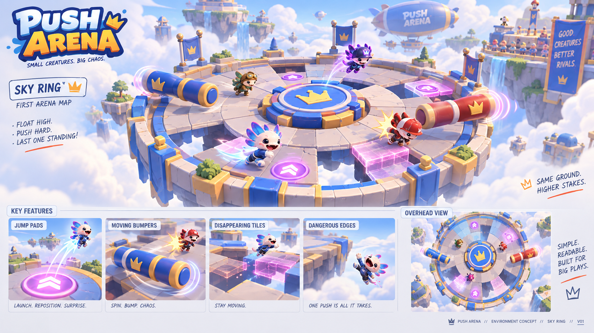
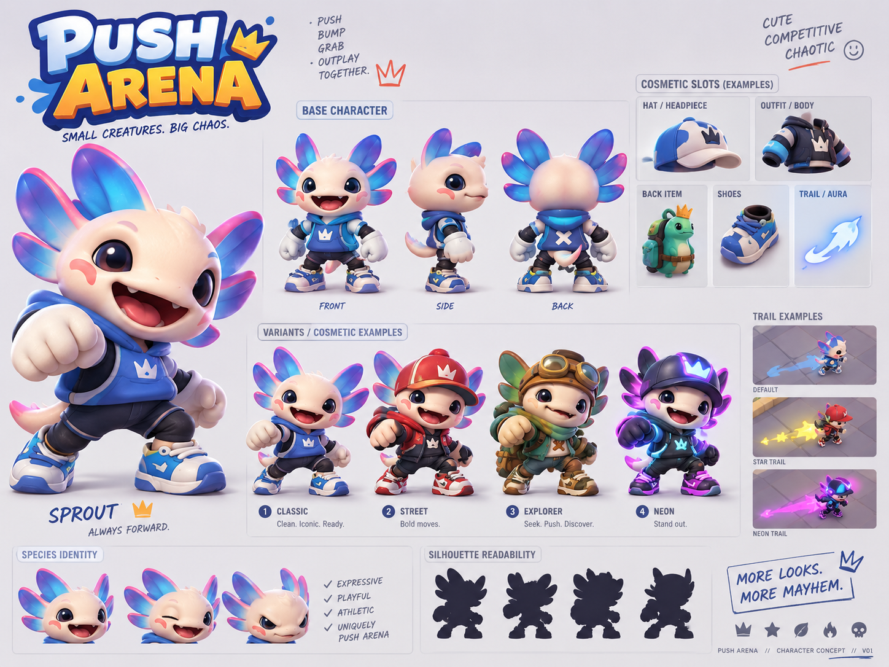
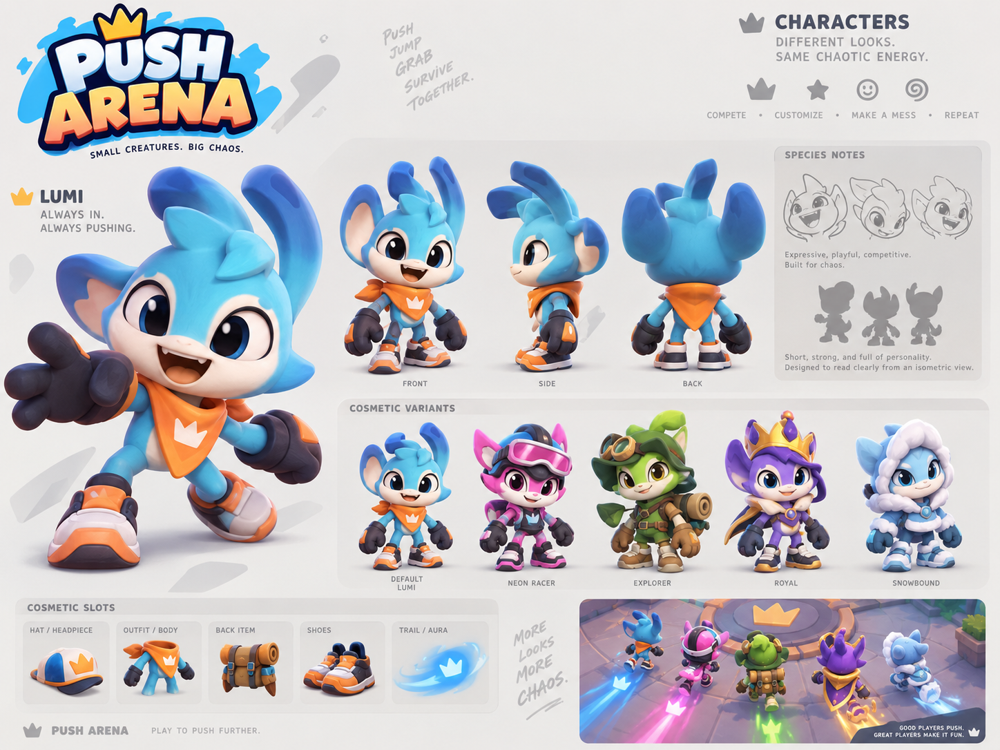
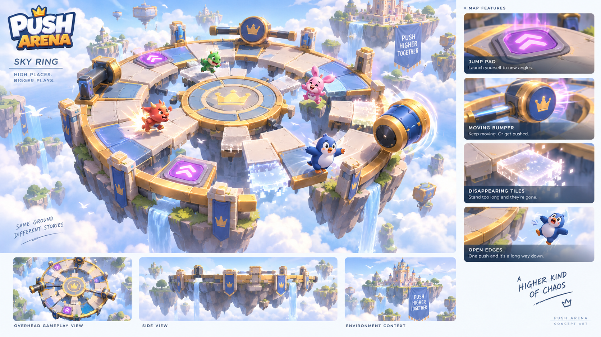
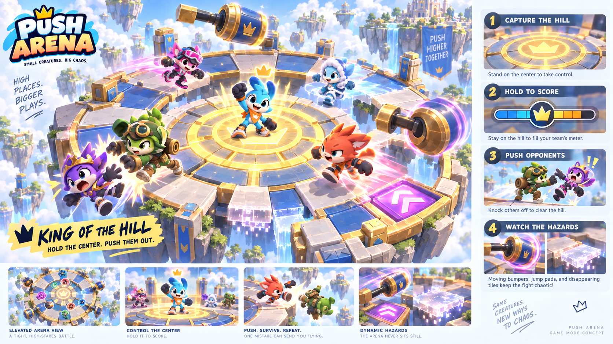
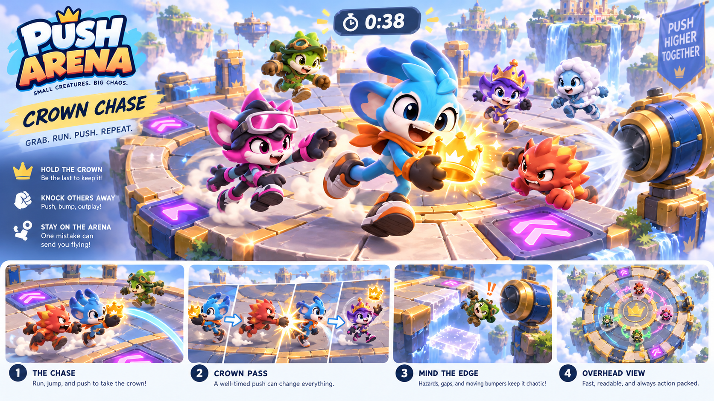
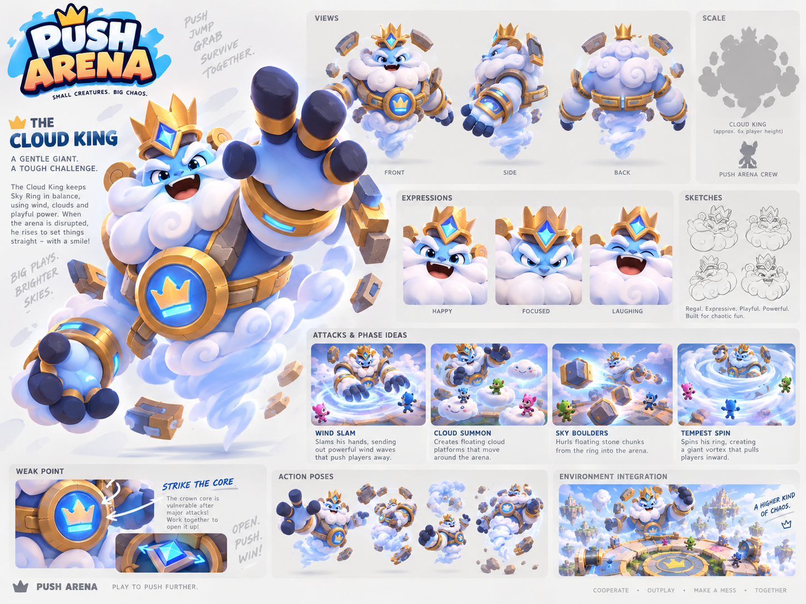
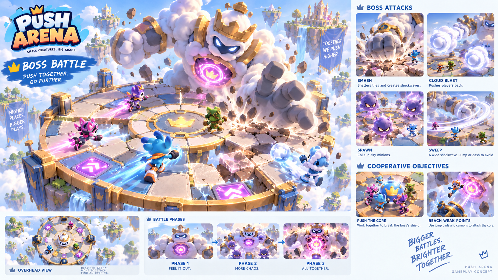
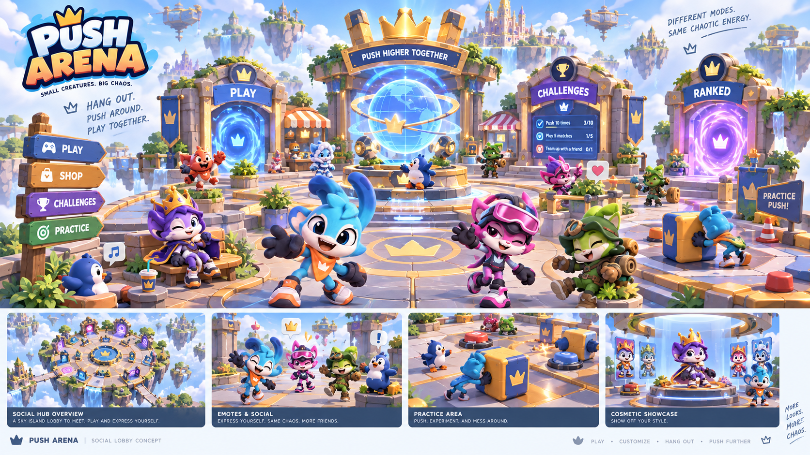
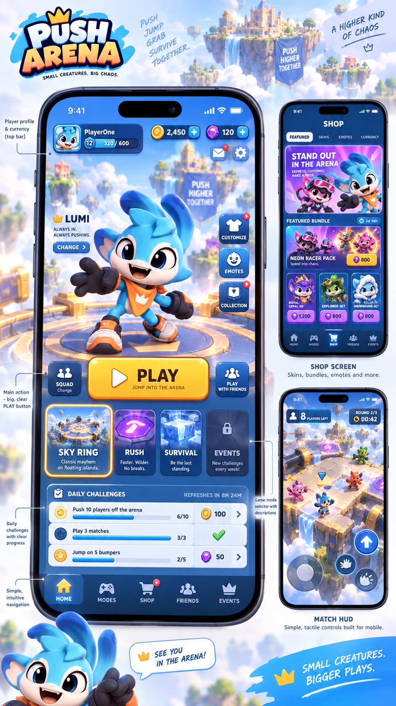

# Knockbound concept art gallery

All ten unique images exposed by the branch conversation's ten-image viewer are preserved locally. Eight were added in the branch recovery follow-up; the original two remain unchanged. Source: [Branch · Assess Game Build Guidance](https://chatgpt.com/c/6a9c044c-94d4-83ea-ab27-4033c4278de0). Retrieved and visually reviewed 2026-09-05.

These are historical generated concepts, not production assets or final decisions. Their original Push Arena labels are preserved as evidence. Use Knockbound for all new branding. Read [branch design details and reconciliations](BRANCH_DESIGN_ADDENDUM.md) before turning image labels into mechanics, currencies or launch requirements.

## Original Sky Ring

Floating ring, crown centerpiece, disappearing tiles, bumpers and jump pads; original environment direction.

## Sprout character

Cream creature with blue/pink head fins, tail, hoodie and sneakers; front/side/back, expressions, slots and outfit variants.

## Lumi character

Blue long-eared creature with orange scarf, large gloves and sneakers; Default Lumi, Neon Racer, Explorer, Royal and Snowbound variants.

## Expanded Sky Ring

Segmented outer ring and central crown island; top/side/environment views, open edges, jump pads, moving bumpers and disappearing bridges.

## King of the Hill

Gold central capture zone, overhead crown, team progress meter and fighting around a contested center.

## Crown Chase

Visible carried crown, pursuit, knockback-driven transfer sequence, timer, open edges and directional hazards.

## Cloud King character and attacks

Cloud body and beard, blue face/hands, gold crown/armor, approximately six-player-height scale, exposed crown core, Wind Slam, Cloud Summon, Sky Boulders and Tempest Spin.

## Cooperative boss encounter

Cloud-and-stone titan, Smash/Cloud Blast/Spawn/Sweep, shared push-core objective, weak-point access and three-phase escalation storyboard.

## Social lobby

Sky-island plaza with Play/Ranked portals, challenge board, emotes, practice pushing, gathering spaces and cosmetic showroom.

## Mobile home, shop and match HUD

Portrait avatar-first home, large Play button, mode cards, challenge progress, shop cards and touch match controls; prices/currencies are mockup examples.

## Provenance

[Image manifest](../assets/source/concepts/history/manifest.json) records stable source file IDs, dimensions, byte sizes and SHA-256 hashes. No expiring signed download URLs are stored. [Asset ledger](../assets/ASSET_MANIFEST.csv) records reference-only status. Originals were copied without retouching, resizing or rebranding.
